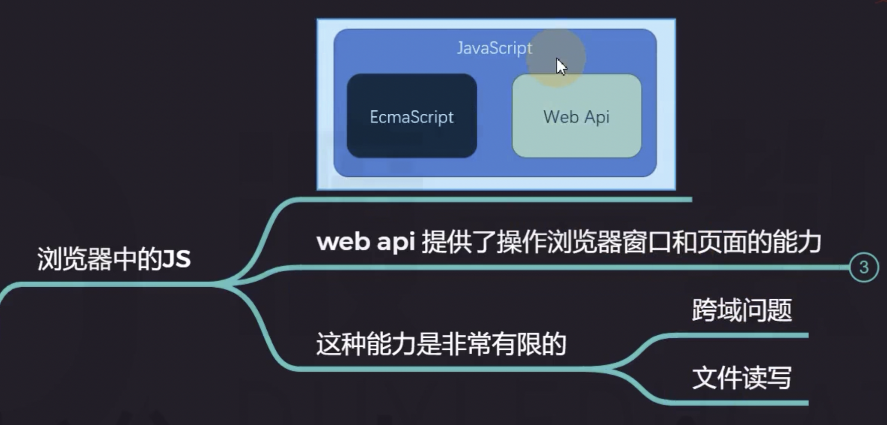
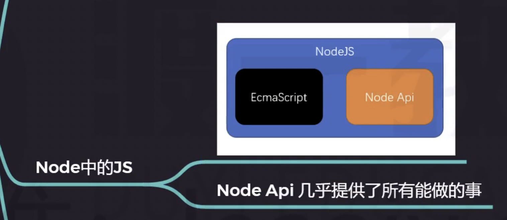
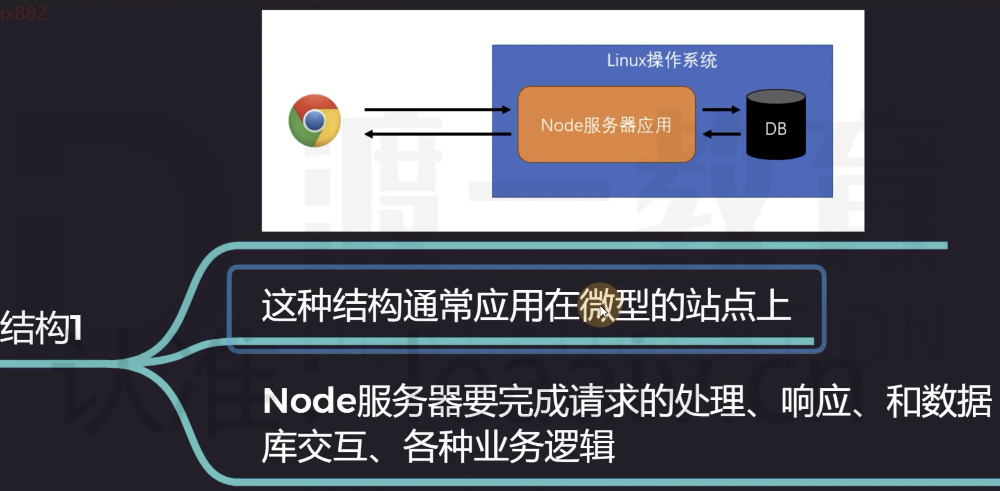
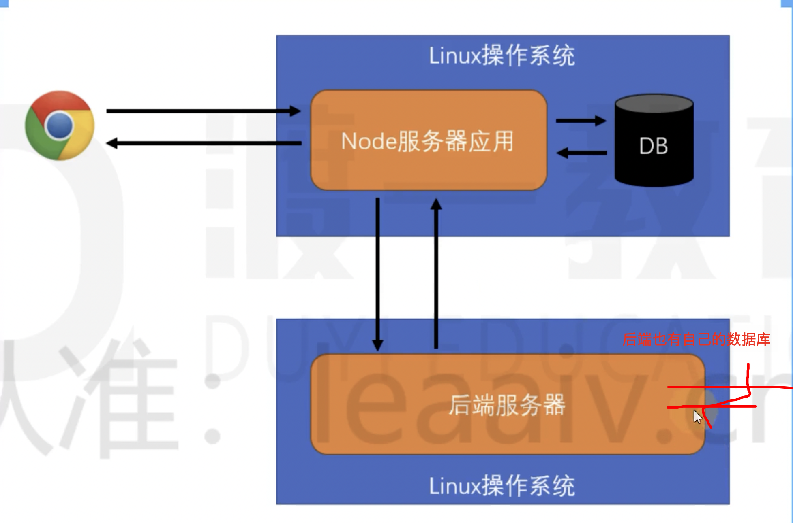

# Node 概述

什么是 Node？

Node 是一个 JS 的允许环境。

拥有比浏览器更多的能力。

> JavaScript 一般指在浏览器运行的 JS，NodeJS 指在 Node 环境运行的 JS!

## 浏览器中的 JS

WebAPI 提供了操作浏览器窗口和页面的能力。

浏览器内的 JS 有很大的限制，例如上传文件。

## NodeJS 中的 JS

## 分层结构对比图

Node 提供的 API 很强大，可以操作文件，可以操作网络，可以操作数据库。

浏览器作为一个操作系统的软件功能是非常强大的，只是不会开发者进行开放。

## Node 的优点

- 是一个单线程的应用程序，使用异步回调模式，不存在线程之间的竞争

- 单线程 IO 处理速度非常快（IO：input/output 输入输出），在主线程操作文件、网卡等

- 简单服务器请求，Node 执行效率比较高，但是不适合做很强大的运算能力

## 用 NodeJS 干什么

- 开发桌面应用程序

- 开发服务器应用程序

客户端发起请求，NodeJS 处理请求，返回响应。

作为一个中间层，也可以记录一些数据到数据库。

## 安装 NodeJS

https://nodejs.org/en/
